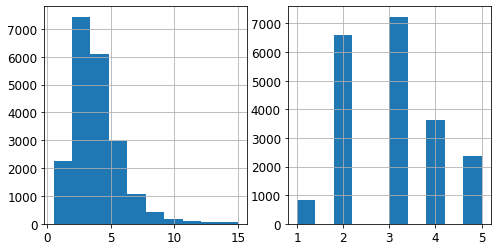
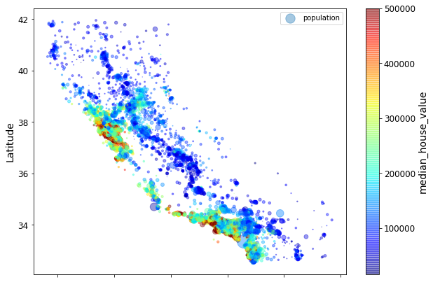

[TOC]

# End-to-End Machine Learning Project

## Get the Data

### Read data

```python
import pandas as pd

housing = pd.read_csv("./datasets/housing/housing.csv")
```

### Take a Quick Look at the Data Structure

```python
housing.head()
housing.info()
housing['ocean_proximity'].value_counts()
housing.describe() # the null values are ignored

# plot a histogram for each numerical attribute
%matplotlib inline
import matplotlib.pyplot as plt
housing.hist(bins=50, figsize=(20, 15)) # histogram 条形图
save_fig("attribute_histogram_plots")  # save figure
plt.show()
```


### Create a Test Set

**随机抽样**

```python
from sklearn.model_selection import train_test_split

train_set, test_set = train_test_split(housing, test_size=0.2, random_state=4)
```

**分层抽样**

```python
from sklearn.model_selection import StratifiedShuffleSplit

# 将"meidan_income"划分为5层
housing["median_income"].hist()
housing['income_cat'] = pd.cut(housing["median_income"],
                              bins=[0, 1.5, 3, 4.5, 6, np.inf],
                              labels=[1, 2, 3, 4, 5])
housing['income_cat'].value_counts()
housing['income_cat'].hist()
"""
plt.figure(figsize=(8,4))
plt.subplot(1,2,1)
housing['median_income'].hist()
plt.subplot(1,2,2)
housing['income_cat'].hist()
"""
split = StratifiedShuffleSplit(n_splits=1, test_size=0.2, random_state=42)  # n_splits：将数据集划分为n组train/test对
for train_index, test_index in split.split(housing, housing['income_cat']):
    strat_train_set = housing.iloc[train_index]
    strat_test_set = housing.iloc[test_index]
```



## Discover and visualize the data to gain insights

### Visualizing Geographical Data

```python
# 创建一个副本，以便在不损害训练集的情况下使用它
housing = strat_train_set_copy()

housing.plot(kind='scatter', x='longitude', y='latitude', alpha=0.4,
            s=housing['population']/100, label='population', figsize(10, 7),
            c='median_house_value', cmap=plt.get_cmap('jet'), colorbar=True)  
"""
alpha: 填充不透明度  colorbar: 色条
The radius of each circle represents the district’s population (option s),
and the color represents the price (option c). We will use a predefined 
color map (option cmap) called jet, which ranges from blue (low values) 
to red (high prices). We assign 0.4 to alpha to make circle obvious. 
"""
plt.xlabel("Longitude")
plt.ylabel("Latitude")
plt.legend()
save.fig("better_vasualization_plot")
```



```python
import matplotlib.image as mpimg
california_img=mpimg.imread(os.path.join(images_path, filename))
ax = housing.plot(kind="scatter", x="longitude", y="latitude", figsize=(10,7),
                       s=housing['population']/100, label="Population",
                       c="median_house_value", cmap=plt.get_cmap("jet"),
                       colorbar=False, alpha=0.4,
                      )
plt.imshow(california_img, extent=[-124.55, -113.80, 32.45, 42.05], alpha=0.5,
           cmap=plt.get_cmap("jet"))
plt.ylabel("Latitude", fontsize=14)
plt.xlabel("Longitude", fontsize=14)

prices = housing["median_house_value"]
tick_values = np.linspace(prices.min(), prices.max(), 11)
cbar = plt.colorbar(ticks=tick_values/prices.max())
cbar.ax.set_yticklabels(["$%dk"%(round(v/1000)) for v in tick_values], fontsize=14)
cbar.set_label('Median House Value', fontsize=16)

plt.legend(fontsize=16)
save_fig("california_housing_prices_plot")
plt.show()
```


